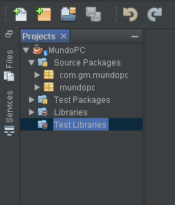
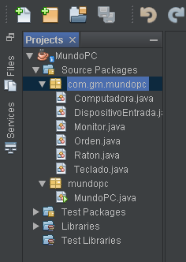
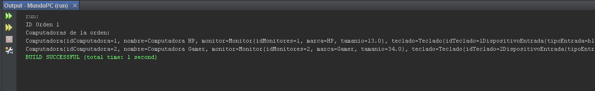

# Java Pricipiantes I

Se cubren los conceptos fundamentales de Java, incluyendo la sintaxis básica del lenguaje, la manipulación de variables, la estructura de control de flujo (como bucles y condicionales), la creación y uso de métodos, y la introducción a la programación orientada a objetos.

Durante el curso, se proporcionan ejemplos prácticos y se realizan ejercicios para reforzar los conceptos aprendidos. Los temas se presentan de manera gradual y se explican con claridad, lo que facilita la comprensión para aquellos que están comenzando con la programación.
## Contenido

- Configuracion de Entorno de desarrollo.

- Uso de NetBeans.

- Sección 1 Variables.

- Sección 2 Tipos Primitivos.

- Sección 3 Operadores.

- Sección 4 Sentencias de Control.

- Sección 5 Ciclos.

- Sección 6 Creación de Clases y Objetos.

- Sección 7 Metodos.

- Sección 8 Constructores.

- Sección 9 Alcance de las Variables.

- Sección 10 Paso de parametros por valor.

- Sección 11 y 12 Uso (return, null, this).

- Sección 13 Encapsulamiento.

- Sección 14 Contexto Estatico.

- Sección 15 Herencia.

- Sección 16 Sobre carga de constructores.

- Sección 17 Sobre carga de metodos.

- Sección 18 Paquetes.

- Sección 19 Palabra Final.

- Sección 20 Arreglos.

- Sección 21 Manejo de matrices.

- Sección 22 Diseño de clases.

- Sección 23 Laboratorio Final MundoPc.

- Sección 24 Laboratorio FinalModificado.


## Instalacion y Ejecucion

- Instala el JDK (Java Development Kit): Descarga e instala la versión adecuada del JDK para tu sistema operativo desde el sitio web oficial de Oracle o de OpenJDK.

- [Descargar JDK 8](https://www.oracle.com/java/technologies/javase/javase8-archive-downloads.html)

- Configura las variables de entorno: Añade la variable de entorno JAVA_HOME que apunte al directorio de instalación del JDK. Añade también la variable de entorno PATH para incluir la ruta al directorio bin del JDK.

- Instala un IDE (Entorno de Desarrollo Integrado): Elige un IDE Java, como Eclipse, IntelliJ IDEA o NetBeans, e instálalo en tu sistema. Estos IDEs proporcionan herramientas y características adicionales para facilitar el desarrollo en Java.

- Configura el IDE: Abre tu IDE y configura la ubicación del JDK. En la configuración, selecciona el directorio de instalación del JDK que has establecido en la variable JAVA_HOME.

- [Descargar NetBeans](https://netbeans.apache.org/front/main/index.html)

- Crea un proyecto: Crea un nuevo proyecto en tu IDE o importa uno existente. Configura la configuración del proyecto, como el tipo de proyecto (aplicación de consola, aplicación web, etc.) y las dependencias necesarias.
- Escribe y ejecuta código: Escribe tu código fuente Java en los archivos del proyecto. Utiliza las herramientas y características del IDE para compilar y ejecutar tu código.
- Depuración y pruebas: Utiliza las capacidades de depuración del IDE para identificar y solucionar problemas en tu código. Ejecuta pruebas unitarias para verificar la funcionalidad de tu programa.
## Resumen y Analisis

- Sección 1 Variables: Las variables son contenedores que almacenan valores en la memoria y se utilizan para almacenar y manipular información en un programa.
- 
- Sección 2 Tipos Primitivos: Los tipos primitivos son los tipos de datos básicos en un lenguaje de programación, como enteros, decimales, caracteres y booleanos.
- 
- Sección 3 Operadores: Los operadores son símbolos o palabras clave que se utilizan para realizar operaciones matemáticas, lógicas o de asignación en un programa.
- 
- Sección 4 Sentencias de Control: Las sentencias de control son estructuras que permiten controlar el flujo de ejecución de un programa, como if-else, switch y bucles.
- 
- Sección 5 Ciclos: Los ciclos son estructuras que permiten repetir un bloque de código varias veces hasta que se cumpla una condición, como for, while y do-while.
- 
- Sección 6 Creación de Clases y Objetos: Las clases son plantillas o moldes para crear objetos en programación orientada a objetos. Los objetos son instancias de una clase que tienen propiedades y comportamientos.
- 
- Sección 7 Métodos: Los métodos son bloques de código reutilizables que realizan una tarea específica. Se definen dentro de una clase y se pueden llamar para ejecutar el código contenido en ellos.
- 
- Sección 8 Constructores: Los constructores son métodos especiales que se utilizan para inicializar objetos de una clase. Se llaman automáticamente al crear un nuevo objeto.
- 
- Sección 9 Alcance de las Variables: El alcance de una variable se refiere a la parte del programa donde la variable es visible y puede ser accedida. Las variables pueden tener alcance local o global.
- 
- Sección 10 Paso de parámetros por valor: Cuando se pasan parámetros a un método, se pueden pasar por valor, lo que significa que se crea una copia de la variable original y se trabaja con esa copia dentro del método.
- 
- Sección 11 y 12 Uso (return, null, this): "return" se utiliza para devolver un valor de un método. "null" se utiliza para indicar la ausencia de un valor. "this" se utiliza para hacer referencia al objeto actual dentro de una clase.
- 
- Sección 13 Encapsulamiento: El encapsulamiento es un concepto de la programación orientada a objetos que consiste en ocultar los detalles internos de una clase y proporcionar acceso controlado a través de métodos.
- 
- Sección 14 Contexto Estático: El contexto estático se refiere a variables y métodos que pertenecen a una clase en lugar de instancias individuales de la clase. Estos elementos se pueden acceder directamente desde la clase sin crear objetos.
- 
- Sección 15 Herencia: La herencia es un mecanismo en la programación orientada a objetos que permite crear nuevas clases basadas en clases existentes. La clase derivada hereda propiedades y comportamientos de la clase base.
- 
- Sección 16 Sobre carga de constructores: La sobrecarga de constructores permite tener múltiples constructores en una clase con diferentes parámetros, lo que permite crear objetos de varias formas.
- 
- Sección 17 Sobre carga de métodos: La sobrecarga de métodos permite tener múltiples métodos con el mismo nombre pero con diferentes parámetros en una clase. Los métodos se diferencian por la cantidad o tipo de parámetros.
- 
- Sección 18 Paquetes: Los paquetes son estructuras utilizadas para organizar y agrupar clases relacionadas en un programa. Proporcionan un espacio de nombres y ayudan a evitar conflictos de nombres.
- 
- Sección 19 Palabra Final: La palabra clave "final" se utiliza en diferentes contextos para indicar que algo es inmutable o no se puede modificar, como variables constantes, métodos finales o clases finales.
- 
- Sección 20 Arreglos: Los arreglos son estructuras de datos que almacenan múltiples valores del mismo tipo. Se accede a los elementos del arreglo utilizando índices.
- 
- Sección 21 Manejo de matrices: El manejo de matrices se refiere a operaciones y manipulaciones realizadas en matrices multidimensionales, que son arreglos de arreglos.
- 
- Sección 22 Diseño de clases: El diseño de clases se refiere a la organización y estructuración de las clases en un programa, definiendo sus propiedades, métodos y relaciones entre ellas.
  
## Proyecto Final

Como desarrollo del proyecto final se realizo una aplicacion sencilla, que muestra por consola una ordenes de encargo de pc.

Donde se muestran la id de la orden y caracteristias de las pc de la orden, como una factura de compra.

- Paquetes





- Resultado




## Ejemplo de Codigo

- Clase main 

```java
package mundopc;

import com.gm.mundopc.*;

public class MundoPC {
    public static void main(String[] args) {
        Monitor monitorHP = new Monitor("HP", 13.0);
        Teclado tecladoHP = new Teclado("bluetooh", "Hp");
        Raton ratonHP = new Raton("bluetooth", "HP");
        Computadora computadoraHP = new Computadora("Computadora HP", monitorHP, tecladoHP, ratonHP);
        
        Monitor monitorGamer = new Monitor("Gamer", 34.0);
        Teclado tecladoGamer = new Teclado("bluetooh", "Gamer");
        Raton ratonGamer = new Raton("bluetooth", "Gamer");
        Computadora computadoraGamer= new Computadora("Computadora Gamer", monitorGamer, tecladoGamer, ratonGamer);
        
        Orden orden1 = new Orden();
        orden1.agregarCoputadora(computadoraHP);
        orden1.agregarCoputadora(computadoraGamer);
        
        orden1.mostrarOrden();
    }
}
```

- Clase computadora

```java
package com.gm.mundopc;

public class Computadora {

    private final int idComputadora;
    private String nombre;
    private Monitor monitor;
    private Teclado teclado;
    private Raton raton;
    private static int contadorComputadoras;

    private Computadora() {
        this.idComputadora = ++Computadora.contadorComputadoras;
    }

    public Computadora(String nombre, Monitor monitor, Teclado teclado, Raton raton) {
        this();
        this.nombre = nombre;
        this.monitor = monitor;
        this.teclado = teclado;
        this.raton = raton;
    }

    public int getIdComputadora() {
        return this.idComputadora;
    }

    public String getNombre() {
        return this.nombre;
    }

    public void setNombre(String nombre) {
        this.nombre = nombre;
    }

    public Monitor getMonitor() {
        return this.monitor;
    }

    public void setMonitor(Monitor monitor) {
        this.monitor = monitor;
    }

    public Teclado getTeclado() {
        return this.teclado;
    }

    public void setTeclado(Teclado teclado) {
        this.teclado = teclado;
    }

    public Raton getRaton() {
        return this.raton;
    }

    public void setRaton(Raton raton) {
        this.raton = raton;
    }

    @Override
    public String toString() {
        return "Computadora{" + "idComputadora=" + idComputadora + ", nombre=" + nombre + ", monitor=" + monitor + ", teclado=" + teclado + ", raton=" + raton + '}';
    }
    
    

}

```

- Clase DispositivoEntrada

```java
package com.gm.mundopc;

public class DispositivoEntrada {
    
   protected String tipoEntrada;
   protected String marca;
   
   public DispositivoEntrada(String tipoEntrada, String marca){
       this.tipoEntrada = tipoEntrada;
       this.marca = marca;
       
   }

    public String getTipoEntrada() {
        return this.tipoEntrada;
    }

    public void setTipoEntrada(String tipoEntrada) {
        this.tipoEntrada = tipoEntrada;
    }

    public String getMarca() {
        return this.marca;
    }

    public void setMarca(String marca) {
        this.marca = marca;
    }

    @Override
    public String toString() {
        return "DispositivoEntrada{" + "tipoEntrada=" + tipoEntrada + ", marca=" + marca + '}';
    }
   
   

}
```
## Autor

- [@GabrielTorrealba](https://github.com/GabrielJose2102)

